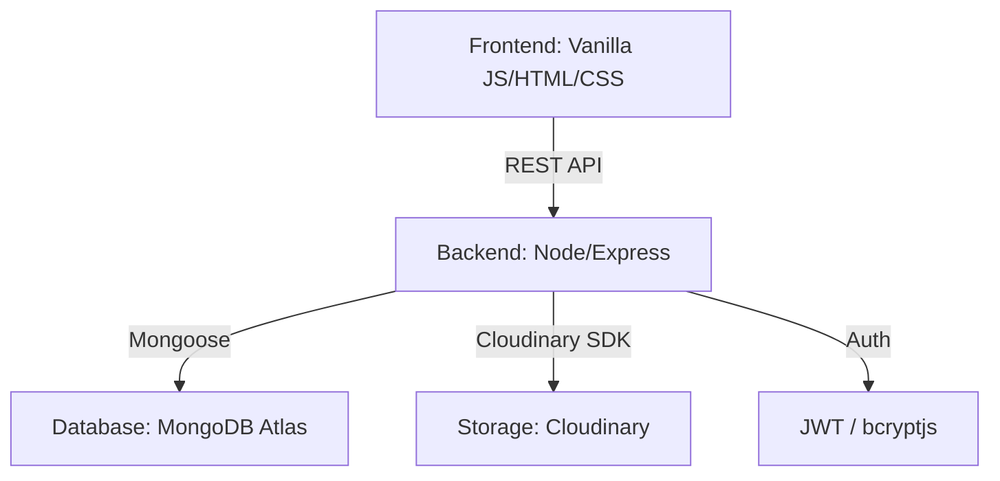

# 🚀 Uzair’s BlogHub - Premium Full-Stack CMS

[](https://nodejs.org/)
[](https://expressjs.com/)
[](https://www.mongodb.com/)
[](https://developer.mozilla.org/en-US/docs/Web/JavaScript)

**Uzair’s BlogHub** is a high-performance, recruiter-ready blogging platform designed with a focus on **Premium UI/UX** and **Scalable Backend Architecture**. It features a modern design system including Glassmorphism, smooth animations, and a fully dynamic CMS backend.

---

## 📸 Desktop Preview
> [!NOTE]
> This project is designed to impress recruiters with its clean code and polished interface.

### ✨ Key Features

#### 🎨 Premium Frontend
- **Modern Homepage:** Interactive hero carousel, parallax effects, and glassmorphism design.
- **Dynamic Blog Grid:** Responsive card layout with real-time client-side search/filtering.
- **Immersive Reading Experience:** Professional typography, breadcrumb navigation, and rich media support.
- **Crystal-Blur Navigation:** Sticky navbar with responsive mobile hamburger menu.
- **Author Attribution:** Personalized "Powered by Muhammad Uzair Baig" branding.

#### ⚙️ Scalable Backend
- **JWT Authentication:** Secure admin login with encrypted token management.
- **MVC Architecture:** Clean separation of concerns for easy scalability.
- **Image Processing:** Integrated Multer & Cloudinary SDK for cloud-based image hosting.
- **Searchable API:** Backend filtering by category and publication status.
- **Automated Slugs:** SEO-friendly URL generation for every blog post.

---

## 🛠️ Tech Stack

| Layer | Technologies |
|---|---|
| **Frontend** | Vanilla HTML5, Modern CSS3 (Variables, Gradients), Vanilla JavaScript (ES6+) |
| **Backend** | Node.js, Express.js |
| **Database** | MongoDB Atlas, Mongoose ODM |
| **Security** | JWT, bcryptjs, CORS, Morgan Logging |
| **Storage** | Cloudinary (Free Tier) for image hosting |

---

## 📂 Project Architecture



---

## 🚀 Quick Start (Full Stack)

### 1️⃣ Clone & Install
```bash
git clone https://github.com/uzairbaig/blog-cms-backend.git
cd blog-cms-backend
npm install
```

### 2️⃣ Environment Setup
Create a `.env` file in the root:
```env
PORT=5000
MONGODB_URI=your_mongodb_cluster_uri
JWT_SECRET=your_secure_secret
JWT_EXPIRE=7d
CORS_ORIGIN=http://localhost:8080
CLOUDINARY_CLOUD_NAME=your_cloud_name
CLOUDINARY_API_KEY=your_api_key
CLOUDINARY_API_SECRET=your_api_secret
```

### 3️⃣ Cloudinary Setup
1. Create a free account at [Cloudinary](https://cloudinary.com/).
2. Copy your **Cloud Name**, **API Key**, and **API Secret** from the Dashboard.
3. Paste them into your `.env` file.

### 3️⃣ Initialize Admin
```bash
npm run create-admin
# Default: admin@blog.com / admin123
```

### 4️⃣ Run Development Servers
**Terminal 1 (Backend):**
```bash
npm run dev
```

**Terminal 2 (Frontend):**
```bash
cd frontend
python -m http.server 8080
```
Access the site at: `http://localhost:8080`

---

## 🔒 Security & Best Practices
- **Password Hashing:** industry-standard bcrypt hashing.
- **Input Validation:** Strict Mongoose schema validation.
- **Error Handling:** Centralized logging and clean error responses.
- **Responsive Web Design:** Fluid layouts testing from 320px to 4K resolutions.

---

## 👨‍💻 Author
**Muhammad Uzair Baig**  
[](https://linkedin.com/in/uzairbaig)
[](https://uzairbaig.netlify.app/)

---

## 📄 License
MIT License - Developed with ❤️ for the developer community.

---

## 🚂 Railway Deployment
1. Push your code to a GitHub repository.
2. Login to [Railway.app](https://railway.app/).
3. Click "New Project" > "Deploy from GitHub repo".
4. Add all variables from your `.env` file to the Railway **Variables** tab.
5. Railway will automatically detect the `start` script and deploy via Nixpacks.

## 🔒 Security Best Practices
- **API Keys:** Never commit your `.env` file to GitHub (it's already in `.gitignore`).
- **Cloudinary:** Use the `api_secret` only on the backend.
- **JWT:** Use a long, complex string for `JWT_SECRET`.
- **Hiding Endpoints:** The project uses `protect` middleware to ensure only authenticated admins can create/delete posts.

**Last Updated:** February 2026
